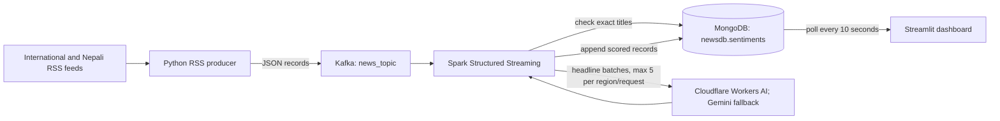

# Newsroom Pulse

Newsroom Pulse is a local, near-real-time news pipeline that collects international and Nepali RSS headlines, scores headline sentiment, stores the results, and presents them in a live dashboard. The project is intended for development and demonstrations; it is not a production-secured deployment.

## Objective

Keep the path from a publisher's RSS feed to a visible, region-specific sentiment result understandable and inspectable. RSS collection, queueing, sentiment scoring, persistence, and presentation are separate components so a slow feed or model request does not have to be handled inside the dashboard.

Sentiment is inferred from the **headline only**. The score is an estimate of the stated event's positive or negative impact, not a fact, a measure of article quality, or a substitute for reading the article.

## Data flow



### Components and rationale

| Component | Role and reason | Code/configuration |
| --- | --- | --- |
| RSS producer | Fetches feeds sequentially, tags records with source and region, and publishes JSON. Kafka producer retries broker startup; a completed feed pass is followed by a 60-second sleep. | `producer/news_producer.py`, `producer/rss_feed.py` |
| Kafka + ZooKeeper | `news_topic` buffers records between RSS collection and scoring. The configured `wurstmeister/kafka` broker uses ZooKeeper. This separates feed availability from model/API latency. | `docker-compose.yml` |
| Spark Structured Streaming | Reads Kafka offsets in micro-batches, checks MongoDB for already-stored titles before any model call, groups new headlines by region, and writes scored records. Spark is the stream consumer/orchestrator; model inference is an external API call, not a local Spark ML model. | `spark/sentiment_stream.py`, `spark/sentiment_pipeline.py` |
| Cloudflare Workers AI + Gemini | Cloudflare Workers AI is the primary provider. Gemini is the fallback when the primary request or response validation fails. The LLM returns JSON scores for batches of up to five headlines. | `spark/sentiment_models.py`, `.env.cloudflare`, `.env.nepali`, `.env` |
| MongoDB | Stores the article and analysis fields as documents so both streaming deduplication and dashboard queries use the same persisted data. A named volume retains data across container restarts. | Compose service `mongo`; database `newsdb`, collection `sentiments` |
| Streamlit + Pandas + Plotly | Presents recent headlines and sources, separate International/Nepali views, sentiment-window averages, and aggregate charts. The fragment reruns every 10 seconds. | `dashboard/app.py` |
| Docker Compose | Runs the local broker, stream processor, database, producer, and UI on one bridge network with stable service names. | `docker-compose.yml`, `Dockerfile` |

Within Compose, `spark-master` coordinates the local Spark cluster, `spark-worker` registers as its single worker, and `spark-submit` launches the streaming application with the Kafka and MongoDB connector packages. The `spark-checkpoint-v2` volume is mounted at `/tmp/spark-checkpoint` so Spark can resume its recorded offsets after a restart.

The current `FEED_URLS` list contains 12 international sources (BBC, CBS, The New York Times, Google News, NPR, The Guardian, Al Jazeera, DW, France 24, CNBC, NBC News, and ABC News) and 7 Nepali sources (Onlinekhabar, Setopati, Nepal News, Ratopati, Nepal Press, The Himalayan Times, and The Kathmandu Post).

The Docker image is based on Apache Spark 3.5.6 with Scala 2.12 and Java 17 because the Spark submission uses Kafka and MongoDB connector artifacts built for that Spark/Scala combination. The same image supplies Python dependencies to the producer and dashboard containers.

## Repository map

- `producer/news_producer.py` — configured RSS feeds, polling loop, title-level in-process deduplication, and Kafka publishing.
- `producer/rss_feed.py` — RSS parsing and recovery of valid entries from malformed feeds.
- `producer/test_rss_feed.py` — offline tests for malformed-feed recovery.
- `producer/test.py` — older standalone publisher; it is **not** the producer launched by Compose. Use `news_producer.py` for the stack.
- `spark/sentiment_stream.py` — Spark session, Kafka source, Mongo title lookup, and streaming query entry point.
- `spark/sentiment_pipeline.py` — stable deduplication, regional grouping, five-headline batching, and result-to-record mapping.
- `spark/sentiment_models.py` — prompts, provider credentials, HTTP requests, JSON validation, pacing, and sentiment labels.
- `spark/batch_sentiment_smoke.py` — optional live API exercise; running it sends real provider requests.
- `spark/test_sentiment_models.py`, `spark/test_sentiment_pipeline.py` — offline provider and pipeline tests.
- `dashboard/app.py` — MongoDB-backed Streamlit UI and analytics.
- `Dockerfile`, `docker-compose.yml`, `requirements.txt` — runtime image, local services, and Python dependencies.
- `AGENTS.md` — repository-specific instructions for coding agents.

## Data and scoring contract

The producer publishes records with these fields:

| Field | Meaning |
| --- | --- |
| `title` | RSS headline. This is the only article content sent to the sentiment provider. |
| `text` | Optional cleaned RSS excerpt, capped at 6,000 characters. Retained for display/coverage analysis; not sent to the sentiment model. |
| `link`, `source`, `region` | Article link, publisher label, and `International` or `Nepali` feed region. |
| `published_at` | Publisher time, falling back to the RSS update time; `null` if neither is available. |
| `ingested_at` | UTC time the producer creates the record before sending it to Kafka. |

The stream adds `sentiment`, `sentiment_score`, `sentiment_confidence`, `sentiment_language`, and `sentiment_model`. Scores range from -100 to +100. Scores at or above +20 are labeled `Positive`; scores at or below -20 are `Negative`; values between them are `Neutral`. Missing headlines are saved as `Unscored` with a null score. Confidence is currently stored as `null` because the provider contract does not return a confidence value.

The Nepali prompt is written in English and explicitly accepts Devanagari Nepali, Romanized Nepali, English, or mixed-language headlines. The international prompt is separate. Both prompts require JSON results and ask the model to score only the stated headline impact. Provider result IDs are validated and mapped back to their input order.

## Deduplication and throughput behavior

- The producer suppresses exact titles already seen by that producer process. That in-memory set resets if the producer restarts.
- Before scoring, Spark checks the current micro-batch and MongoDB for exact matching titles. Existing and same-batch duplicates are removed before an API request. Mongo's title index is not unique; this is application-level deduplication, not a database uniqueness guarantee.
- Kafka is configured with six partitions and replication factor one. Spark starts with `maxOffsetsPerTrigger=5`; the pipeline additionally batches at no more than five headlines per region/request.
- `startingOffsets=earliest` applies when Spark initializes a fresh checkpoint. With the existing checkpoint volume, a restarted query resumes from its recorded Kafka offsets.
- Spark currently collects each micro-batch to the driver before deduplication and API scoring. This keeps provider calls and title matching in one process for the demo, but it limits scaling and is not distributed inference.
- Provider calls are paced within the Spark process using the configured minimum request intervals. This is not a provider quota guarantee and does not coordinate rate limits across multiple running Spark applications.

## Configure credentials

From the repository root, create local environment files from the examples:

```sh
cp .env.example .env
cp .env.cloudflare.example .env.cloudflare
cp .env.nepali.example .env.nepali
```

Replace placeholders locally; never commit the resulting files. `.gitignore` excludes `.env`, `.env.cloudflare`, and `.env.nepali`.

- `.env.cloudflare`: international Cloudflare account ID/token, model ID, and request interval.
- `.env.nepali`: Nepali-specific Cloudflare account ID/token and optional Nepali Gemini fallback key.
- `.env`: international Gemini fallback key and Gemini request interval. Compose reads `GEMINI_API_KEY` from this file for the Spark service.

The configured Cloudflare default is `@cf/meta/llama-3.1-8b-instruct`; the Gemini fallback model is `gemini-3.1-flash-lite` in code. International credentials use the unsuffixed variable names. Nepali credentials use `_NEPALI` suffixes, including `GEMINI_API_KEY_NEPALI`.

Relevant settings:

| Variable | Default / use |
| --- | --- |
| `CLOUDFLARE_ACCOUNT_ID`, `CLOUDFLARE_API_TOKEN` | Required for international Cloudflare inference. |
| `CLOUDFLARE_MODEL_ID` | `@cf/meta/llama-3.1-8b-instruct`. |
| `CLOUDFLARE_MIN_REQUEST_INTERVAL_SECONDS` | `6` seconds between provider request starts by default. |
| `GEMINI_API_KEY` | International fallback credential; provided to Spark through Compose interpolation. |
| `GEMINI_MIN_REQUEST_INTERVAL_SECONDS` | `6` seconds by default. |
| `CLOUDFLARE_ACCOUNT_ID_NEPALI`, `CLOUDFLARE_API_TOKEN_NEPALI` | Nepali Cloudflare credentials. |
| `GEMINI_API_KEY_NEPALI` | Nepali fallback credential. |
| `MONGO_URI` | Dashboard Mongo connection string; Compose sets it to `mongodb://mongo:27017/`. |

The application does not rotate through multiple keys. Keep credentials region-specific as shown; provider fallback is Cloudflare to Gemini.

## Run the local stack

Docker Desktop and internet access are required for image pulls, RSS requests, and Spark connector downloads. After creating the environment files above:

```sh
docker compose up --build -d
docker compose ps
docker compose logs -f producer spark-submit dashboard
```

Open <http://localhost:8501>. The dashboard reads MongoDB; it does not read Kafka directly. Kafka's external listener is published on `localhost:9092`; the stack's producer and Spark job use the internal `kafka:9093` address. MongoDB is published on `localhost:27017` for local inspection.

To stop containers while preserving MongoDB and Spark checkpoint data:

```sh
docker compose down
```

To intentionally remove the Compose-managed persisted data as well:

```sh
docker compose down --volumes
```

The second command deletes the MongoDB data volume and Spark checkpoint volume. Do not use it when you need to preserve demo data. Kafka/ZooKeeper are not configured with persistent data volumes in this Compose file.

## Tests and live API smoke run

The tests use Python `unittest` and do not call external model APIs. Run them in an environment with the project requirements installed; the Spark suite also needs PySpark, which is supplied by the Docker base image but is not installed from `requirements.txt`.

```sh
# RSS recovery tests
docker compose run --rm --no-deps --entrypoint python3 producer \
  -m unittest discover -s /opt/news-sentimental/producer -p 'test_*.py'

# Sentiment model and pipeline tests
docker compose run --rm --no-deps --entrypoint python3 spark-submit \
  -m unittest discover -s /opt/news-sentimental/spark -p 'test_*.py'
```

Compose requires the environment files referenced by `spark-submit` to exist before it can parse the full configuration. The optional `spark/batch_sentiment_smoke.py` sends live requests and can incur provider usage; it loads `.env` and `.env.cloudflare` itself. For the Nepali example, export the region-specific variables from `.env.nepali` into the shell first—the smoke runner does not load that file.

## Dashboard behavior

- Home shows up to 30 recent headlines for the selected region, with publisher/source, publish time in Nepal time, label, and score.
- The two header metrics are average sentiment among scored stories published in the last 60 minutes and last 24 hours. The analytics view separately reports ingestion counts based on `ingested_at`.
- Analytics aggregates the newest 500 records returned for that region and shows sentiment mix, source counts, and hourly/daily counts.
- If no `published_at` exists, a story can appear without a publish-time label and is excluded from the publish-time windows/charts.

## Known limits and safety

- Headlines can be ambiguous, multilingual, or too short for reliable interpretation. Scores are model estimates; neutral scores are not proof that a story has no impact.
- `sentiment_language` is a simple script heuristic: a headline containing Devanagari is labeled Nepali; other scripts are labeled English. Romanized Nepali can therefore be mislabeled even though the Nepali prompt accepts it.
- Title deduplication is exact-string based; punctuation, whitespace, or alternate headlines for the same story are not canonicalized.
- The Compose configuration is for local development: Kafka uses plaintext listeners, MongoDB has no authentication configured, and the dashboard is exposed on the host. Do not expose these ports to an untrusted network.
- The RSS source list lives in `FEED_URLS` in `producer/news_producer.py`. Feeds are fetched sequentially and each request can wait up to 30 seconds, so the actual interval between passes can exceed the 60-second sleep.
